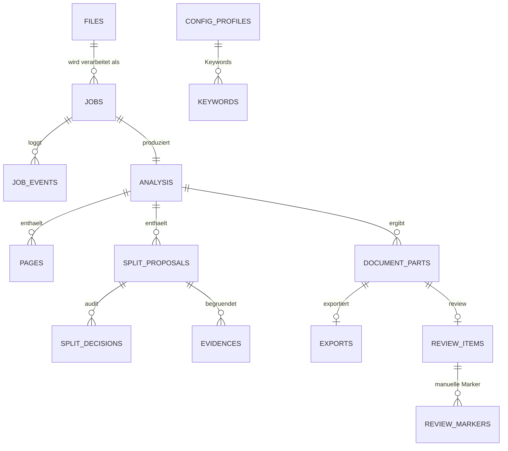
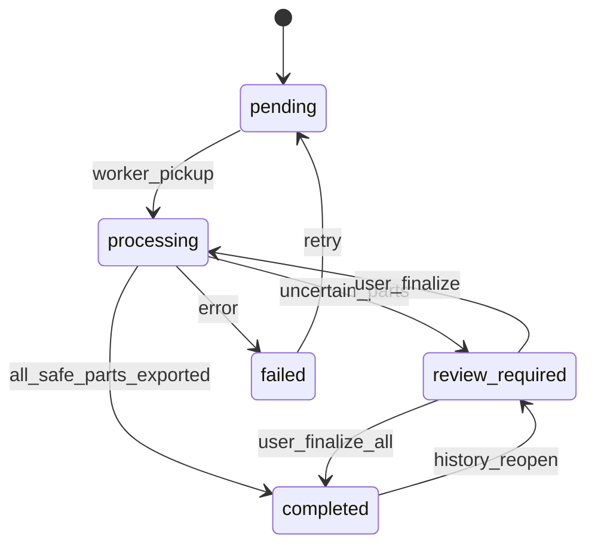

# DocuNomNom – v1 Architektur- und Implementierungsplan (revidiert)

> Diese Revision verschärft den ersten Entwurf entlang der vom User vorgegebenen v1-Leitplanken: weniger optionale Adapter, DB-als-Queue, klarere Modi, Pflicht-Evidenz, Datei-Stabilitaet, robustes Reprocessing, klare externe-API-OCR-Anforderungen.

Aenderungen gegenueber Version 1 sind je Abschnitt mit "Aenderung:" markiert und kurz begruendet.

---

## 0. Explizite Annahmen und v1-Constraints

Annahmen

- Ollama laeuft als separater Dienst und ist nur per HTTP erreichbar. DocuNomNom liefert Ollama nicht aus.
- Genau ein Benutzer/Haushalt; kein Multi-Tenant in v1.
- Eingangs- und Ausgangsverzeichnis werden per Bind-Mount eingehaengt; `work/`, `output/`, `archive/` liegen auf demselben Dateisystem (atomares `rename(2)` ist Pflicht).
- v1 nur PDF-Eingaben.
- v1 betreibt **genau einen Worker-Prozess**. Horizontaler Scale-out ist explizit ausgeschlossen.
- DB-Datei liegt **lokal** auf einem ZFS-Dataset, niemals auf SMB/NFS-Mount (siehe §3 SQLite-Constraints).

Aenderung gg. v1: Single-Worker-Constraint ist jetzt eine explizite Architektur-Invariante, nicht nur Empfehlung. Begruendung: konsistent mit DB-als-Queue + SQLite-WAL.

---

## 1. Architekturvorschlag

In v1 zwei Container (`api+ui` und `worker`), gemeinsames Image, gemeinsames Datenvolumen.

```mermaid
flowchart LR
    subgraph Host[TrueNAS Host]
      direction TB
      subgraph Mounts[Bind-Mounts]
        IN[/input PDFs/]
        OUT[/paperless consume/]
        ARCH[/archive/]
        DATA[(data: db, work, thumbs, ocr_artifacts)]
      end
    end

    subgraph DocuNomNom
      direction LR
      Watcher[Stability Watcher<br/>Polling + Rescan]
      DBQ[(DB Job-Queue<br/>SQLite WAL)]
      OCR[OcrPort<br/>OCRmyPDF | GenericApiOcr]
      FX[Feature Extractor]
      Rules[Rule-Based Splitter<br/>Keywords + Heuristiken]
      AI[AiSplitPort<br/>off/validate/refine/enhance]
      EV[Evidence Validator<br/>Pflicht-Gate]
      Conf[Confidence Aggregator]
      Exporter[Atomic Exporter]
      Review[Review Service]
      Hist[History Service]
      Cfg[Config Service]
      API[FastAPI HTTP API]
      UI[React UI]
      Worker[Worker Process<br/>single]
    end

    Ollama[(Ollama HTTP)]
    OpenAI[(OpenAI API)]
    ExtOcr[(Externer OCR-Provider via HTTP)]

    IN --> Watcher --> DBQ --> Worker
    Worker --> OCR --> FX --> Rules --> AI --> EV --> Conf
    Conf -->|safe parts| Exporter --> OUT
    Conf -->|uncertain| Review
    Worker --> Hist
    Worker --> ARCH
    UI <--> API
    API <--> Review
    API <--> Hist
    API <--> Cfg
    API <--> DBQ
    Worker <--> DBQ
    AI <-.HTTP.-> Ollama
    AI <-.HTTP.-> OpenAI
    OCR <-.HTTP.-> ExtOcr
```


Designprinzipien

- Strikte Hexagonal-/Ports-and-Adapters-Struktur. Kern (Domain + Use-Cases) kennt keine Frameworks und keine Provider-SDKs.
- Adapters kapseln OCR-/KI-Backends hinter stabilen Interfaces (`OcrPort`, `AiSplitPort`).
- Worker und API laufen im selben Repo, aber als separate Prozesse/Container.
- Append-only Audit (`job_events`, `split_decisions`).
- Reprocessing wird ueber einen kombinierten Schluessel ermoeglicht (siehe §4).

Aenderung gg. v1: KI-Pipeline laeuft jetzt explizit ueber den Evidence-Validator als Pflicht-Gate vor Confidence-Aggregation. Begruendung: Anti-Halluzination ist nicht optional.

---

## 2. Technologie-Stack

Kern

- Backend: Python 3.12, FastAPI, Pydantic v2, SQLAlchemy 2 (sync ist ausreichend, siehe §3), Alembic.
- Worker: dasselbe Python-Repo, eigener Entrypoint, **direkter DB-Polling-Loop** (kein zusaetzliches Queue-System).
- DB: SQLite (WAL) in v1; Migrationspfad zu Postgres dokumentiert.
- PDF/OCR: `OCRmyPDF`, `pikepdf`, `pdfplumber`, `pypdfium2` (Thumbs).
- HTTP-Clients fuer externe Provider: `httpx` mit explizitem Timeout/Retry-Wrapper.
- Frontend: React 18 + TypeScript, Vite, TanStack Query, Tailwind + shadcn/ui, `react-pdf` (pdf.js), `react-i18next` (en, de).
- Tests: `pytest`, `pytest-asyncio` (nur wo noetig), `httpx`-Testclient, `respx` fuer HTTP-Mocks, `playwright` fuer UI-Smoke.

Begruendungen

- DB-Polling statt APScheduler/Redis: weniger bewegliche Teile; v1 hat geringe Last.
- Sync SQLAlchemy: SQLite + Single-Worker profitiert nicht von async-DB; reduziert Komplexitaet.
- Generic-API-OCR-Adapter: ein gut getesteter Adapter mit Provider-Profil-Konfiguration deckt v1; spezialisierte Provider-Adapter (Mistral, Google DocAI) bleiben explizit post-v1.

Empfohlenes Ollama-Modell fuer Split-Reasoning: `qwen2.5:14b-instruct` (Default), Fallback `qwen2.5:7b-instruct`.

- Begruendung: starke Mehrsprachigkeit (DE/EN), zuverlaessige JSON-/Schema-Adhaerenz, gutes strukturiertes Reasoning, im Deutschen besser als Llama 3.1 8B, deutlich genuegsamer als 32B+.

Aenderung gg. v1: APScheduler entfaellt; Async-DB entfaellt; OCR-Adapter-Liste auf 2 reduziert.

---

## 3. SQLite-Constraints und Reichweite (v1-Pflicht)

Das DB-Setup ist Teil der Architektur-Invarianten und wird im Code erzwungen:

- **WAL** beim Start gesetzt (`PRAGMA journal_mode=WAL`).
- **busy_timeout** auf z.B. 5000 ms (`PRAGMA busy_timeout=5000`).
- **synchronous=NORMAL** (mit WAL ausreichend).
- **foreign_keys=ON**.
- Jede Schreibtransaktion ist **kurz**: pro Job-Übergang ein Statement-Bundle, schwere CPU-/IO-Arbeit (OCR, AI, Export) liegt **ausserhalb** offener Transaktionen.
- **Genau ein Worker-Prozess** (single writer); API darf lesen und kurze Statuswechsel schreiben.
- DB-Datei muss **lokal auf einem ZFS-Dataset** liegen, nicht auf SMB/NFS. Beim Start wird via `os.statvfs` und Mount-Inspektion geprueft, ob der Pfad in einer bekannten Risikoklasse liegt; bei Verdacht harter Abbruch mit klarer Meldung.
- Backups: nur `VACUUM INTO`/Litestream-kompatibel; kein File-Copy waehrend Betrieb.

Migrationspfad nach Postgres

- Alle Repos hinter Interfaces in `core/ports/`.
- Keine SQLite-spezifischen Features (`json_each`, etc.) in Repos; JSON wird ueber portable SQLAlchemy-Typen abgebildet.
- Alembic-Migrationen sind dialect-neutral.

Aenderung gg. v1: explizite, im Code erzwungene Constraints; SMB/NFS-Verbot.

---

## 4. Verzeichnis- und Modulstruktur

```
docunomnom/
  backend/
    pyproject.toml
    src/docunomnom/
      api/
        routers/
        deps.py
        main.py
      core/
        models/
        usecases/
        ports/             # OcrPort, AiSplitPort, JobQueuePort, StoragePort, ClockPort
        rules/
        confidence/
        evidence/          # Evidence-Validator (Pflicht-Gate fuer KI-Vorschlaege)
      adapters/
        ocr/
          ocrmypdf.py
          generic_api.py   # einziger externer OCR-Adapter in v1
          profiles/        # YAML-Profile fuer konkrete Anbieter (post-v1 erweiterbar)
        ai_split/
          none.py
          ollama.py
          openai.py
        pdf/
        http/              # httpx-Wrapper mit Timeout/Retry/Errorklassen
      storage/
        db/                # SQLAlchemy Models, Repositories, Queue-Repo
        migrations/
        files/             # Work/Archive/Thumb/OCR-Artefakt-Pfade
      worker/
        main.py
        watcher.py         # Stability-Watcher
        loop.py            # DB-Polling-Loop, Lease, Retry
        pipeline.py
      config/
      i18n/
      tests/
        unit/
        adapter/
        api/
        worker/
        e2e/
        fixtures/pdfs/
  frontend/
    package.json
    src/
      app/
      features/
        review/            # minimal: PDF, Vorschlaege, Marker, Finalize
        history/
        config/
        jobs/
      components/ui/
      i18n/locales/{en,de}.json
      api/
      lib/
    tests/
      unit/
      e2e/
  deploy/
    docker/
      Dockerfile
      compose.yaml
      compose.truenas.yaml
    scripts/
      entrypoint.sh
  docs/
    architecture.md
    api.md
    operations.md
  AGENTS.md
```

Erzwungene Hexagonal-Grenzen via `import-linter` (CI-Check).

Aenderung gg. v1: getrennter `evidence/`-Modul, `http/`-Wrapper-Modul, `generic_api.py`-OCR-Adapter mit Provider-Profilen statt mehrerer Adapter.

---

## 5. Datenmodell




Felder (Auszug)

- `files(id, sha256, original_name, size, mtime, source_path, archived_path, created_at)` — `sha256` ist **nicht** unique.
- `jobs(id, file_id, status, mode, attempt, lease_until, error_code, error_msg, created_at, updated_at, run_key, config_snapshot_id, pipeline_version)`
- `job_events(id, job_id, ts, type, payload_json)` — append-only Audit
- `analysis(id, job_id, ocr_backend, ai_backend, ai_mode, page_count, created_at, ocr_artifact_path)`
- `pages(id, analysis_id, page_no, ocr_text, ocr_text_truncated_bool, layout_json, hash)`
- `split_proposals(id, analysis_id, source: rule|ai|merged, start_page, end_page, confidence, reason_code, status: candidate|approved|rejected|review)`
- `evidences(id, proposal_id, kind: keyword|layout_break|sender_change|page_number|structural|ocr_snippet, page_no, snippet, payload_json)` — **mind. 1 Eintrag fuer jeden AI-erzeugten oder AI-modifizierten Vorschlag erforderlich**
- `split_decisions(id, proposal_id, actor: rule|ai|user, action, ts, payload_json)`
- `document_parts(id, analysis_id, start_page, end_page, decision: auto_export|review_required|user_confirmed, confidence, export_id?)`
- `exports(id, part_id, output_path, output_name, sha256, exported_at)`
- `review_items(id, part_id, status: open|in_progress|done, reviewer_notes, finished_at?)`
- `review_markers(id, review_item_id, page_no, kind: start|reject_split, ts)`
- `config_profiles(id, name, json_blob, hash)` (genau ein "active")
- `keywords(id, profile_id, term, locale, enabled, weight)`
- `config_snapshots(id, profile_id, hash, ai_backend, ai_mode, ocr_backend, pipeline_version, created_at)` — unveraenderlich

Reprocessing-Schluessel

- `jobs.run_key = sha256(file_sha256 || config_snapshot.hash || pipeline_version)`.
- Es darf maximal ein **aktiver** Job pro `run_key` existieren (Partial-Index `WHERE status IN ('pending','processing','review_required')`).
- Ein User kann jederzeit ein Reprocessing ausloesen, wenn sich Profil/Backend/Modus oder Pipeline-Version geaendert hat → neuer `run_key`, neuer Job, alter Job bleibt in History.

Aenderung gg. v1: `files.sha256` nicht mehr unique; neuer `run_key`/`config_snapshot`/`pipeline_version`; eigene `evidences`-Tabelle als harter Constraint fuer KI-Vorschlaege.

---

## 6. OCR-Datenhaltung

Regeln

- `pages.ocr_text` wird in der DB gespeichert, **wenn praktikabel**: harte Obergrenze pro Seite (z.B. 64 KB). Bei Ueberschreitung wird `ocr_text` getrimmt, `ocr_text_truncated_bool=true` gesetzt, und der vollstaendige Text als Datei in `data/ocr_artifacts/<analysis_id>/page_<n>.txt` abgelegt.
- Grosse Roh-Artefakte (z.B. hOCR, Provider-JSON, durchsuchbares PDF von OCRmyPDF) liegen ausschliesslich auf der Platte unter `data/ocr_artifacts/<analysis_id>/...`. `analysis.ocr_artifact_path` zeigt darauf.
- `evidences.snippet` enthaelt nur kurze Zitate (z.B. <= 500 Zeichen) plus `page_no` als Referenz; nie den ganzen Text.
- `layout_json` ist klein, strukturiert (Bloecke, Boxes, Header-Marker) und immer in DB.

Aenderung gg. v1: Trennung "klein in DB / gross auf Platte" ist explizit; harte Obergrenzen.

---

## 7. API-Design (REST, OpenAPI, `/api/v1`)

Auth-Slot bleibt: jede Route geht durch `deps.get_principal()`; v1 liefert `AnonymousPrincipal` mit `["*"]`-Capabilities.

Ressourcen (gegenueber v1 leicht reduziert)

- `GET  /api/v1/health`
- `GET  /api/v1/jobs?status=…&limit=…&cursor=…`
- `GET  /api/v1/jobs/{id}`
- `POST /api/v1/jobs/rescan`
- `POST /api/v1/jobs/{id}/retry`
- `POST /api/v1/jobs/{id}/reprocess` — erzeugt neuen Job mit aktuellem Profil/Backend/Modus
- `GET  /api/v1/review` — offene Items, default-Filter "uncertain"
- `GET  /api/v1/review/{id}` — Item, Seiten, vorhandene Vorschlaege, Marker
- `GET  /api/v1/review/{id}/pdf` — range-faehiges PDF-Streaming
- `PUT  /api/v1/review/{id}/markers` — Volltext-Set persistent
- `POST /api/v1/review/{id}/finalize` — atomarer Export
- `GET  /api/v1/history?from=…&to=…&q=…`
- `GET  /api/v1/history/{part_id}`
- `POST /api/v1/history/{part_id}/reopen` — neues Review-Item
- `GET/PUT /api/v1/config`
- `GET/POST/PUT/DELETE /api/v1/config/keywords`

Konventionen

- ETag/`If-Match` auf review-/config-aendernden Endpoints.
- Strukturierte Fehler: `code`, `message`, `details`, `traceId`.
- Polling reicht; kein WebSocket in v1.
- Thumbnails sind v1 optional (siehe v1-Guardrails).

Aenderung gg. v1: neuer `reprocess`-Endpoint; Thumbnails und WebSocket explizit aus v1 raus.

---

## 8. Job-Lifecycle / State Machine




Regeln

- Statusuebergaenge ausschliesslich via `usecases/transition_job.py`, validiert gegen Whitelist.
- DB-Queue-Mechanik:
  - `worker.loop.poll()` selektiert in **einer** Transaktion einen Job (`SELECT ... LIMIT 1` mit `WHERE status='pending' OR (status='processing' AND lease_until < now)`), setzt `status='processing'`, `lease_until=now+lease_ttl`, `attempt=attempt+1`.
  - Heartbeats verlaengern `lease_until` regelmaessig (z.B. alle 30 s).
  - Crash-Recovery: abgelaufene Leases werden beim naechsten Poll wieder aufgenommen; nach `max_attempts` → `failed` mit Reason-Code.
- Sicherer Export-Punkt: erst nach erfolgreichem `rename(2)` aller Auto-Export-Parts wechselt der Job nach `completed`.
- Archivierung erst nach erfolgreichem Export.

Aenderung gg. v1: explizite SQL-Skizze der Lease-Mechanik; kein externer Scheduler.

---

## 9. Datei-Ingestion und Stabilitaetspruefung

Vor jeder Aufnahme in die Job-Queue:

1. Pfad-Filter: nur `*.pdf` (case-insensitive), keine Dot-/Tilde-/Tmp-Dateien.
  - Default-Ignore-Patterns: `^\.`, `~$`, `\.crdownload$`, `\.part$`, `\.partial$`, `\.tmp$`.
2. Stabilitaets-Test (konfigurierbar, Default 10 s):
  - Erste Beobachtung: `(size, mtime, inode)` festhalten.
  - Nach `stability_window` erneut messen. Nur wenn alle drei Werte unveraendert sind, gilt die Datei als stabil.
  - Open-FD-Probe (Best Effort): wenn `lsof`/`/proc/*/fd` verfuegbar, optional pruefen, ob ein anderer Prozess die Datei geoeffnet hat. Bei "in Benutzung" weiter warten.
3. Mindestgroesse-Check (z.B. > 1 KB), Header-Magic-Check (`%PDF-`).
4. SHA-256 erst nach Stabilitaet berechnen.
5. Job wird mit aktuellem `config_snapshot_id` und `pipeline_version` angelegt; `run_key` wie in §5 berechnet.

Aenderung gg. v1: neuer Pflicht-Schritt; verhindert das Anfassen halbgeschriebener Dateien aus SMB-/Scanner-Quellen.

---

## 10. Konfigurationsdesign

Quellen (hoechste Prioritaet zuerst): UI-Aenderung (DB) > ENV > YAML-Default-Datei > Code-Default.

YAML-Skelett (`config/default.yaml`)

```yaml
paths:
  input: /data/input
  output: /data/output
  archive: /data/archive
  work:   /data/work
  ocr_artifacts: /data/ocr_artifacts
  db:     /data/db/docunomnom.sqlite
runtime:
  uid: 1000
  gid: 1000
  poll_interval_seconds: 5
  worker_lease_ttl_seconds: 120
  max_concurrent_jobs: 1            # v1-Invariante
  pipeline_version: "1.0.0"
ingestion:
  stability_window_seconds: 10
  ignore_patterns: ["^\\.", "~$", "\\.crdownload$", "\\.part$", "\\.partial$", "\\.tmp$"]
  min_size_bytes: 1024
processing:
  archive_originals: true
  prefer_undersplit: true
  review_all_splits: false
ocr:
  primary: ocrmypdf                 # ocrmypdf | external_api
  ocrmypdf:
    languages: ["eng", "deu"]
    rotate_pages: true
    deskew: true
  external_api:
    profile: generic                # generic | (post-v1: mistral, google_docai)
    base_url: ""
    auth:
      type: bearer                  # none | bearer | header_key
      token_env: EXTERNAL_OCR_TOKEN
      header_name: Authorization
    request:
      max_payload_mb: 25
      chunk_pages: 50               # Splitten grosser PDFs in Teilanfragen
    timeouts_seconds:
      connect: 10
      read: 120
      total: 600
    retry:
      max_attempts: 3
      backoff_initial_ms: 500
      backoff_max_ms: 8000
      retry_on_status: [408, 425, 429, 500, 502, 503, 504]
    privacy:
      allow_external_egress: false  # muss explizit eingeschaltet werden
      allowed_hosts: []
ai_split:
  backend: ollama                   # none | ollama | openai
  mode: enhance                     # off | validate | refine | enhance
  ollama:
    base_url: http://ollama:11434
    model: qwen2.5:14b-instruct
  openai:
    api_key_env: OPENAI_API_KEY
    model: gpt-4o-mini
  thresholds:
    auto_export_min_confidence: 0.85
    review_required_below: 0.70
  evidence:
    require_for_ai: true            # Pflicht
    min_evidences_per_proposal: 1
    allowed_kinds: [keyword, layout_break, sender_change, page_number, structural, ocr_snippet]
  refine:
    max_boundary_shift_pages: 1     # max. Verschiebung pro adjust
    max_changes_per_analysis: 3     # darueber: Bereich in Review
keywords:
  locale_default: de
  enabled: true
  terms:
    - {term: "rechnung", locale: de}
    - {term: "invoice", locale: en}
    - {term: "bescheid", locale: de}
    - {term: "kontoauszug", locale: de}
    - {term: "vertrag", locale: de}
    - {term: "aufnahmevertrag", locale: de}
    - {term: "einverständniserklärung", locale: de}
    - {term: "privatliquidation", locale: de}
i18n:
  default_language: en
  available: [en, de]
```

Sicherheitsrelevant: Secrets ausschliesslich per ENV-Referenzen, nie in YAML/DB.

Aenderung gg. v1: AI-Modi heissen jetzt `off | validate | refine | enhance`; Ingestion-Stability-Section neu; Generic-API-OCR-Block mit Timeouts/Retry/Privacy neu; `pipeline_version` erstklassig.

---

## 11. AI-Split-Modi (praezise)

- `off`
  - Nur Regeln + Keywords + Heuristiken. Keine HTTP-Calls an KI.
- `validate`
  - KI darf vorhandene Vorschlaege **nur bewerten** (confirm/reject inkl. Confidence + Reason-Code).
  - **Keine** Grenzanpassungen, **keine** neuen Splitpunkte.
  - Erlaubte Aktionen im Adapter-Schema: `confirm`, `reject`.
- `refine`
  - KI darf vorhandene Vorschlaege **bewerten und konservativ anpassen, ausschliesslich wenn Evidenz vorliegt**.
  - Erlaubte Beispiele:
    - benachbarte Vorschlaege zusammenfuehren (`merge`)
    - eine bestehende Grenze geringfuegig verschieben (`adjust`)
    - einen offensichtlich falschen vorhandenen Split korrigieren (kombinierbar aus `merge`+`adjust`)
  - **Nicht erlaubt**:
    - voellig neue Splitpunkte erzeugen
    - breite Re-Segmentierung des Dokuments
  - Erlaubte Aktionen im Adapter-Schema: `confirm`, `reject`, `merge`, `adjust`.
  - Quantitative Konservativitaets-Schranken (im Validator hart durchgesetzt):
    - `adjust`: maximale Verschiebung der Grenze um `refine.max_boundary_shift_pages` Seiten (Default 1).
    - `merge`: nur direkt benachbarte `split_proposals` (keine Luecken zwischen ihnen).
    - Pro Analyse hoechstens `refine.max_changes_per_analysis` Aenderungen (Default 3); darueber wird der Bereich in Review umgeleitet.
- `enhance`
  - KI darf zusaetzlich zu den vorhandenen Vorschlaegen **neue** Splitpunkte vorschlagen, ausschliesslich wenn Evidenz vorliegt.
  - Alle Aktionen aus `refine` bleiben erlaubt.
  - Erlaubte Aktionen im Adapter-Schema: `confirm`, `reject`, `merge`, `adjust`, `add`.

Pflicht-Gate fuer alle KI-Aktionen: Evidence Validator (siehe §12). Der Validator erzwingt zusaetzlich die modus-spezifische Aktions-Whitelist; jede Aktion ausserhalb der Whitelist wird mit `rejected_by_validator` (Reason-Code `mode_action_violation`) abgelehnt und audit-protokolliert.

Aenderung gg. v1: Modus-Namen vereinheitlicht (kein `_only`-Suffix mehr) und Aktions-Whitelists pro Modus explizit. Begruendung: macht "konservativ" im `refine`-Modus pruefbar und im Code erzwingbar.

---

## 12. Evidence Validator (Pflicht)

Position: zwischen `AiSplitPort` und `Confidence Aggregator`. Jeder vom AI-Adapter zurueckgelieferte oder veraenderte Vorschlag durchlaeuft den Validator, bevor er ueberhaupt in `split_proposals` landet.

Eingaben

- Der Vorschlag (Start-/Endseite, Aktion: confirm/reject/merge/adjust/add).
- Vom AI-Adapter strukturiert geforderte `evidences`-Liste (siehe Schema).

Validator-Regeln

1. **Modus-Whitelist**: die `action` des Vorschlags muss zum aktiven AI-Modus passen (siehe §11). Verstoss → Ablehnung mit Reason-Code `mode_action_violation`.
2. **Refine-Schranken** (nur im Modus `refine`): `adjust` darf eine Grenze um maximal `refine.max_boundary_shift_pages` Seiten verschieben; `merge` nur direkt benachbarter Vorschlaege ohne Luecke; pro Analyse maximal `refine.max_changes_per_analysis` AI-Aenderungen.
3. Es muss mindestens `evidence.min_evidences_per_proposal` Evidenz-Eintrag/-Eintraege geben (Default 1).
4. Erlaubte `kind`-Werte: `keyword | layout_break | sender_change | page_number | structural | ocr_snippet`.
5. `page_no` muss innerhalb des Vorschlags-Bereichs (oder direkt an dessen Grenze) liegen.
6. Falls `kind=keyword`: das Keyword muss im aktiven Profil enabled sein und im OCR-Text der referenzierten Seite tatsaechlich vorkommen (case-insensitive).
7. Falls `kind=ocr_snippet`: das Snippet muss als Substring im OCR-Text der referenzierten Seite gefunden werden (Fuzzy-Toleranz konfigurierbar).
8. Falls `kind=sender_change`/`layout_break`/`structural`: muss in `pages.layout_json` der Nachbarseiten verifizierbares Merkmal (z.B. neuer Header/Boxen-Bruch) referenzieren.
9. Falls `kind=page_number`: extrahierte Seitenzahl-Sequenz muss in `pages.layout_json` vorhanden sein und einen Reset/Sprung an der vorgeschlagenen Grenze zeigen.

Reaktion bei Fehlschlag

- Vorschlag wird **abgelehnt** (Audit-Eintrag in `split_decisions`, `actor=ai`, `action=rejected_by_validator`, Grund codiert).
- Falls dadurch ein Bereich ohne sicheren Vorschlag entsteht, wandert der betroffene Teil als `review_required` in den Review.
- Im Modus `enhance` sind so erzeugte "abgelehnte Add-Vorschlaege" weder im UI noch im Export sichtbar — nur in History/Audit.

Schema, das der KI-Adapter liefern muss (Pydantic-Skizze)

```python
class Evidence(BaseModel):
    kind: Literal["keyword","layout_break","sender_change","page_number","structural","ocr_snippet"]
    page_no: int
    snippet: str | None = None
    payload: dict = {}

class AiProposal(BaseModel):
    action: Literal["confirm","reject","merge","adjust","add"]
    start_page: int
    end_page: int
    confidence: float
    reason_code: str
    evidences: list[Evidence]
```

Aenderung gg. v1: Evidence-Validator ist jetzt eigener Modul (`core/evidence/`), mit eigenem Schema, eigener Tabelle und eigenen Tests; Pflicht-Gate vor Aggregation.

---

## 13. Externer-OCR-API-Adapter (Generic)

Position: `adapters/ocr/generic_api.py`. Nutzt `adapters/http/`-Wrapper.

Konfiguration: siehe `ocr.external_api` in §10. Provider-Spezifika werden ueber Profile (`adapters/ocr/profiles/*.yaml`) abgebildet (Endpoint-Pfad, Request-/Response-Mapping). v1 enthaelt **nur** das `generic`-Profil; konkrete Provider sind post-v1.

Anforderungen (v1-Pflicht)

- **Timeouts**: separat fuer `connect`, `read`, `total`. Default `10s/120s/600s`. Kein "ohne Timeout".
- **Retry-Policy**: exponentielles Backoff mit Jitter; nur auf konfigurierter Status-Whitelist (`429`, `5xx`, `408`, `425`); nicht-idempotente Operationen werden nur dann wiederholt, wenn der Adapter beweisen kann, dass kein Teilfortschritt entstand (z.B. ueber Content-Hash oder Provider-Idempotency-Keys).
- **Payload-Groesse**: harte Obergrenze (`max_payload_mb`); zu grosse PDFs werden in Seiten-Chunks zerlegt (`chunk_pages`), Ergebnisse zusammengefuehrt; partielle Chunk-Fehler fuehren zu Job-Fehlschlag mit klarer Klassifikation.
- **Fehlerklassifikation**: jede Provider-Antwort wird auf eine interne Klasse abgebildet:
  - `transient` (Retry erlaubt)
  - `client_config` (4xx ausser 408/425/429 → kein Retry, Job `failed`, Reason-Code)
  - `payload_too_large` (Retry mit kleinerer Chunkung)
  - `auth` (kein Retry, Job `failed`, deutliche Meldung)
  - `provider_quota`/`rate_limit` (Backoff)
  - `timeout` (begrenzter Retry)
- **Privacy/Network-Boundary**:
  - `allow_external_egress=false` ist Default; ein externer OCR-Call nur, wenn dieses Flag explizit aktiv ist **und** der Zielhost in `allowed_hosts` aufgefuehrt ist.
  - Beim Wechsel auf `external_api` zeigt das UI eine deutliche Warnung "Daten verlassen das lokale Netzwerk".
  - Ein Audit-Event `ocr.external_call` wird pro Anfrage geschrieben (Host, Bytes, Status, Dauer; **kein** PDF-Inhalt).
- **TLS**: Nur HTTPS akzeptiert; Self-Signed muss explizit per Konfig aktiviert werden.
- **Logs/Telemetrie**: Anfrage-Metadaten ja, Klartext-OCR-Inhalte nur auf DEBUG.

Aenderung gg. v1: nur **ein** generischer externer OCR-Adapter mit klar definierten Sicherheits-/Resilienzanforderungen; spezifische Provider verschoben.

---

## 14. Docker/Deployment fuer TrueNAS

Zwei Container, ein Image.

```yaml
# deploy/docker/compose.yaml
services:
  api:
    image: ghcr.io/<org>/docunomnom:${TAG:-latest}
    command: ["uvicorn", "docunomnom.api.main:app", "--host", "0.0.0.0", "--port", "8080"]
    ports: ["8080:8080"]
    environment:
      PUID: ${PUID:-1000}
      PGID: ${PGID:-1000}
      DOCUNOMNOM_CONFIG: /config/config.yaml
    volumes:
      - ${INPUT_DIR}:/data/input
      - ${OUTPUT_DIR}:/data/output
      - ${ARCHIVE_DIR}:/data/archive
      - ${DATA_DIR}:/data
      - ${CONFIG_DIR}:/config
    restart: unless-stopped
    healthcheck:
      test: ["CMD", "curl", "-fsS", "http://localhost:8080/api/v1/health"]
      interval: 30s
  worker:
    image: ghcr.io/<org>/docunomnom:${TAG:-latest}
    command: ["python", "-m", "docunomnom.worker.main"]
    environment: { PUID: ${PUID:-1000}, PGID: ${PGID:-1000}, DOCUNOMNOM_CONFIG: /config/config.yaml }
    volumes:
      - ${INPUT_DIR}:/data/input
      - ${OUTPUT_DIR}:/data/output
      - ${ARCHIVE_DIR}:/data/archive
      - ${DATA_DIR}:/data
      - ${CONFIG_DIR}:/config
    depends_on: [api]
    restart: unless-stopped
    deploy:
      replicas: 1                 # v1-Invariante
```

TrueNAS-Spezifika

- `work/`, `output/`, `archive/`, `db/`, `ocr_artifacts/` muessen auf demselben ZFS-Dataset liegen (Same-FS-Check beim Start).
- Zweites Compose-File `compose.truenas.yaml` mit `/mnt/<pool>/...`-Vorlagen.
- Image: Debian-slim, OCRmyPDF + Tesseract eng/deu vorinstalliert. Multi-Stage-Build (Frontend statisch, vom Backend gehostet).
- Keine internen Datenbanken/LLMs.

Aenderung gg. v1: Worker-Replicas explizit auf 1 fixiert; `ocr_artifacts/` als eigenes Pfad-Konzept.

---

## 15. Berechtigungen / UID/GID

- Image-User `app` (uid 1000, gid 1000).
- `entrypoint.sh` liest `PUID`/`PGID`, passt UID/GID an, dann `exec gosu app …`.
- `umask 002`, Dateien `0664`, Verzeichnisse `0775`.
- Output nach `rename` ggf. `chown` auf Zielwerte.
- Beim Start Pflichtpruefungen: Existenz, Schreibbarkeit, Same-Filesystem, kein SMB/NFS fuer DB-Pfad. Bei Fehler harter Abbruch mit klarer Meldung.

---

## 16. Security / Auth-Readiness

- v1 Runtime ohne Auth, aber Architektur "auth-first":
  - `deps.get_principal()` an jeder Route, v1: `AnonymousPrincipal` mit `["*"]`.
  - Capability-basierte Autorisierung in Use-Cases.
  - Cookies: SameSite=strict vorbereitet, in v1 deaktiviert.
- Default-Bind ans interne Netz/Reverse-Proxy (Doku in `operations.md`).
- Keine Secrets im Image, nicht in DB; nur ENV.
- Strikte Pfad-Sandbox (`storage/files/safe_path.py`).
- Externe HTTP-Calls (Ollama/OpenAI/External-OCR) nur an konfigurierte Hosts; Allowlist im Config Service; `allow_external_egress` als Master-Schalter.
- Audit-Trail (`job_events`, `split_decisions`, `ocr.external_call`) Pflicht.
- Strukturierte JSON-Logs; OCR-Klartext nur auf DEBUG.

---

## 17. Test-Strategie

Pflicht: Tests entstehen mit der jeweiligen Funktion in derselben PR.

Schichten

- Unit (Kern):
  - `core/rules/`: Tabellen-Tests fuer Keyword-Treffer (DE/EN, Akzente, Case, Wortgrenzen).
  - `core/confidence/`: Tabellen-/Property-Tests fuer Aggregator inkl. Schwellwertgrenzen.
  - `core/evidence/`: erschoepfende Tabellen-Tests pro `kind`, Grenzfaelle (Snippet nicht im OCR, Page out of range, Keyword disabled).
  - State-Machine: erlaubte/verbotene Uebergaenge.
- Adapter:
  - `OcrPort`-Fakes; OCRmyPDF-Adapter gegen kleine Mini-PDF-Fixtures.
  - `generic_api.py` gegen `respx`-Mocks: Timeout, Retry-Backoff, Status-Whitelist, Payload-Splitting, jede Fehlerklasse, TLS-Pflicht, Audit-Event geschrieben.
  - `AiSplitPort`-Fakes pro Modus (`off/validate/refine/enhance`); Ollama/OpenAI via `respx`.
- API: `httpx`-Testclient gegen FastAPI; Snapshot des OpenAPI-Schemas (Drift-Schutz).
- Worker/Job-Lifecycle: simulierte Pipeline mit FakeOcr+FakeAi; explizite Tests fuer Lease-Expiry und Crash-Recovery; Reprocessing mit geaenderter Config erzeugt neuen `run_key`.
- Stability-Watcher: Tabellen-Tests fuer Ignore-Patterns, fuer "Datei waechst noch", fuer "stable nach N Sekunden".
- Exporter:
  - `rename`-Atomaritaet (Strom-aus-Simulation: Datei in Output existiert nie partiell).
  - Cross-Device-Write hart abgelehnt.
  - Kollisionssuffixe deterministisch.
- UI:
  - Vitest + React Testing Library fuer Komponenten.
  - Playwright Smoke-E2E: Job-Liste, Review oeffnen, Marker setzen, Finalize, Reopen aus History.
- E2E (Backend): docker-compose-Lauf mit echtem OCRmyPDF gegen Fixture-PDFs:
  1. Eindeutiger Single-Doc-PDF → Auto-Export.
  2. Klar getrennte 3-Doc-Mappe → 3 Auto-Export-Parts.
  3. Mehrdeutige Mappe → mind. ein Part im Review.
  4. Gescannter Mischbestand mit Drehfehlern.
- Regression: jedes gemeldete Fehlsplit-Beispiel landet als anonymisierte Mini-Fixture + Test im Repo.

CI-Gates: `ruff`, `mypy --strict` auf `core/`, `pytest -q`, `vitest run`, `playwright test --grep @smoke`, `import-linter`, Coverage `core/` >= 90 %.

Aenderung gg. v1: explizite Test-Buckets fuer Evidence-Validator, Stability-Watcher und Generic-API-OCR-Resilienz.

---

## 18. Risikoanalyse

- KI-Halluzinationen → Modi-Stufenleiter, Pflicht-Evidence-Validator, konservative Schwellwerte, "prefer under-split".
- OCR-Qualitaet → OCRmyPDF mit Auto-Rotate/Deskew; externer Provider als optionaler Ausweich (mit Egress-Schalter).
- Atomaritaet bricht → Same-FS-Check beim Start; harter Fehler.
- SQLite-Locks → WAL + busy_timeout + Single-Worker + kurze Transaktionen + lokales ZFS-Dataset.
- Speicher/CPU fuer Ollama → 7B-Fallback; Backend `none`/`openai` als Ausweich.
- TrueNAS-Permissions → PUID/PGID + Permissions-Check beim Start.
- Privacy bei Cloud-OCR/AI → `allow_external_egress`-Master-Schalter, Allowlist, UI-Warnung, Audit.
- LLM-Lock-in → Port-Abstraktion; Prompts/Schemas im Repo versioniert.
- Halbgeschriebene Eingangsdateien → Stability-Watcher, Magic-Header-Check, Open-FD-Probe.
- Reprocessing-Verwirrung → `run_key` aus Datei + Config-Snapshot + Pipeline-Version; Partial-Index gegen Doppel-Aktive.

---

## 19. Phasenplan (v1, gestrafft)

Jede Phase endet lauffaehig & getestet.

- Phase 0 — Repo & Tooling (1–2 Tage)
  - Monorepo-Skeleton, `pyproject`, `ruff`/`mypy`/`pytest`, Vite-App, `import-linter`, CI, leere Architektur-Schichten, Dockerfile, Compose-Skelett.
- Phase 1 — Domain, Storage, DB-Queue, Stability (3–5 Tage)
  - Entities, Repos, Migrations (inkl. `evidences`, `config_snapshots`, `run_key`), DB-Queue-Loop (Lease/Heartbeat/Crash-Recovery), State Machine, Config Service, Permissions/Entry-Point, Stability-Watcher, Tests fuer alle Uebergaenge und Watcher-Faelle.
- Phase 2 — OCR-Backends + Rule-Splitter + Atomic Export (4–6 Tage)
  - OCRmyPDF-Adapter, **Generic-API-OCR-Adapter** mit Timeouts/Retry/Klassifikation/Privacy, Feature Extractor, Keyword-Engine, regelbasierte Confidence, atomarer Exporter, OCR-Datenhaltung (DB + `ocr_artifacts/`), E2E-PDF #1+#2.
- Phase 3 — API + UI-Basis (3–4 Tage)
  - Routen Jobs/History/Config/Keywords/Reprocess; UI mit Job-Liste, History, Config-/Keyword-Editor, i18n (en+de). Noch ohne Review.
- Phase 4 — Minimaler Review-Workflow (3–5 Tage)
  - `react-pdf`-Viewer, Anzeige der Vorschlaege, Marker setzen/entfernen, Finalize, Reopen aus History, Tests (Component + Playwright Smoke), E2E-PDF #3.
- Phase 5 — AI-Split + Evidence-Validator (4–6 Tage)
  - `AiSplitPort`, Adapter `none`/`ollama`/`openai`, Modi `off/validate/refine/enhance`, Pflicht-Evidence-Validator vor Aggregation, Schwellwert-Tuning, Provider-Mocks + lokaler Ollama-Smoke.
- Phase 6 — Hardening & TrueNAS-Release (2–3 Tage)
  - Healthcheck, Backup-Doku, Crash-Recovery-Tests, Permissions-/Egress-Hardening, Release-Image, `compose.truenas.yaml`, `operations.md`, Regression-Fixturen-Set, v1-Tag.

Aenderung gg. v1: ehemalige Phase 6 (mehrere OCR-Backends) entfaellt; OCR-Arbeit in Phase 2 buendelt OCRmyPDF + Generic-API-Adapter; Phase 5 enthaelt Evidence-Validator als Pflicht.

---

## 20. v1 Scope Guardrails

Bewusst **nicht** in v1:

- Provider-spezifische OCR-Adapter (Mistral, Google Document AI) — nur via Generic-API + Profile vorbereitet.
- Mehrere Worker-Prozesse / horizontaler Scale-out.
- Externe Job-Queue (Redis, RabbitMQ, RQ, Celery).
- Postgres als Default (nur Migrationspfad offen).
- Authentifizierung/Autorisierung im Runtime-Verhalten (nur Architektur-Slot).
- WebSocket-/Server-Push-API; Polling reicht.
- Server-seitige Thumbnail-Erzeugung; pdf.js im Browser reicht.
- OCR/AI-Modell-Selbsttraining oder automatisches Modell-Tuning (nur Audit-Daten gesammelt).
- Tagging/Klassifikation/Metadaten-Anreicherung der Ausgabedokumente.
- E-Mail-/Webhook-Notifier.
- Multi-User, Rollen, Mandantentrennung.
- Bild-/Office-Eingaben (nur PDF in v1).
- Komplexe Review-Tools (Annotationen, Drag-Reorder, Zusammenfuehren mehrerer Quelldateien).
- Tastatur-Shortcuts und virtualisiertes Scrollen im Review (Buttons/Klicks reichen in v1; spaeter optional).

